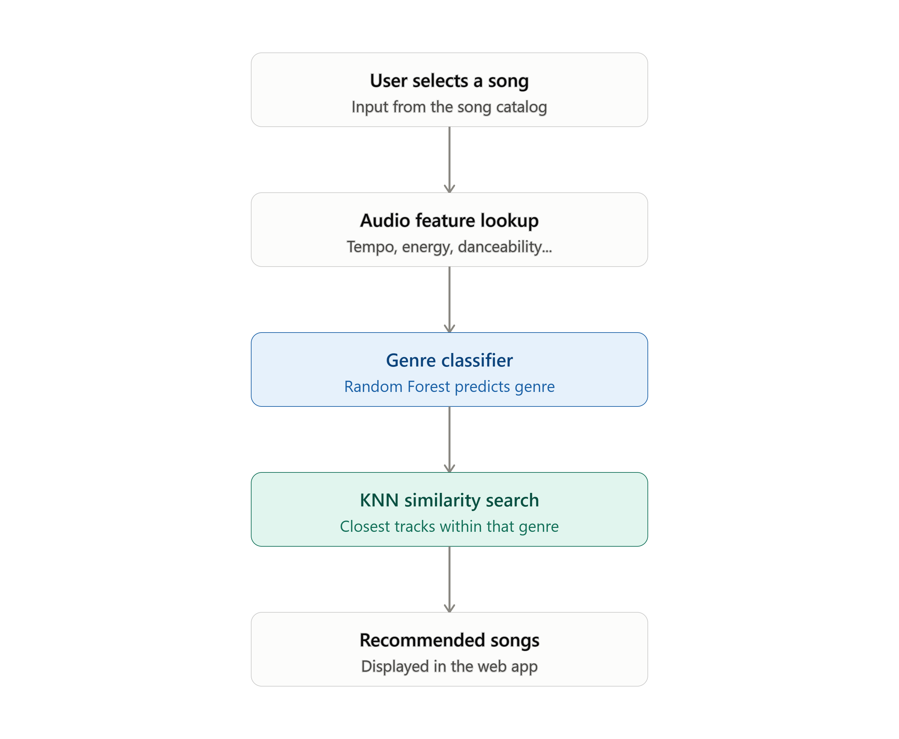

# AudioBot — AI-Powered Music Recommendation System

CS 254 (Introduction to Artificial Intelligence) Final Project — content-based
music recommendation system built on real Spotify track data.

## Overview

AudioBot recommends songs based on audio-feature similarity within a song's
genre, rather than relying on other users' listening history (which this
dataset does not include). A Random Forest classifier is trained and
evaluated as the project's core supervised-learning component; the live
recommendation feature itself is driven by each song's real, known genre
label plus a K-Nearest Neighbors (KNN) similarity search.

## System Architecture

1. User selects a song from the app.
2. The app looks up that song's audio features (tempo, energy, danceability,
   etc.) and its real genre label.
3. The Random Forest classifier also predicts the song's genre, shown
   alongside the real label for comparison — this prediction does **not**
   drive what gets recommended (see "Why the classifier's accuracy doesn't
   limit recommendation quality" below).
4. KNN finds the closest-matching songs within the song's real genre, using
   scaled audio-feature distance.
5. Recommended songs are displayed in the web app.



## Dataset

Spotify Tracks Dataset (Kaggle), by Yash Dev:
https://www.kaggle.com/datasets/yashdev01/spotify-tracks-dataset

Download the CSV and place it in the project root as
`spotify-tracks-dataset.csv` before running scripts 01-03 (this raw file is
not included in the repo — see `.gitignore`). The derived, cleaned datasets
(`spotify_tracks_clean.csv`, `spotify_tracks_broad_genre.csv`) **are**
included in this repo, so you can skip straight to training or running the
app without re-downloading anything, if you just want to see it work.

## Setup

```bash
python -m venv venv
venv\Scripts\activate        # Windows
# source venv/bin/activate   # macOS/Linux
pip install -r requirements.txt
```

## How to Run

### Quick path — just run the app

The trained models and processed data are already included in this repo, so
you can go straight to:

```bash
python app.py
```

Then open the URL Flask prints (typically http://127.0.0.1:5000) in your
browser, pick a genre and a song, and view its recommendations.

### Full pipeline — reproduce everything from scratch

If you want to regenerate the data and retrain the models yourself (this
requires downloading the raw dataset first — see "Dataset" above):

1. `python 01_load_explore.py` — inspect the raw dataset (shape, columns,
   dtypes, sample rows).

2. `python 02_data_quality.py` — check missing values, duplicate rows, and
   the raw genre distribution.

3. `python 03_preprocessing.py` — clean the data (drops rows missing
   critical fields, removes duplicate track_ids) and save
   `spotify_tracks_clean.csv`.

4. `python 04_train_classifier.py` — train the baseline Random Forest on all
   113 raw genres. Saves `genre_classifier.pkl`, `label_encoder.pkl`, and a
   confusion-matrix heatmap (`confusion_matrix.png`). Real test accuracy:
   **32.7%**.

5. `python 06_genre_consolidation.py` — consolidate the 113 raw genres into
   13 broader, more acoustically coherent genres (drops non-genre mood/
   activity tags like "sad," "chill," "study"). Saves
   `spotify_tracks_broad_genre.csv`.

6. `python 07_train_broad_classifier.py` — train the improved Random Forest
   on the 13 consolidated genres, using SMOTE to balance underrepresented
   classes. Saves `genre_classifier_broad_smote.pkl` and
   `label_encoder_broad.pkl`. Real test accuracy: **57.4%**.
7. `python app.py` — launch the web app (uses the broad-genre model from
   step 6, via `knn_recommender.py`).

### Extended evaluation — algorithm comparison, feature engineering, and cross-dataset validation

Three further questions were investigated after the core pipeline above,
per instructor/FI feedback: could feature engineering improve on 57.4%,
would other algorithms (including SVM) do better than Random Forest, and
does synthetic data generalize to real data? All three are in `experiments/`,
kept separate from the core numbered pipeline since they're diagnostic/
validation work, not required steps to run the app.

```bash
cd experiments
python 08_algorithm_and_feature_comparison.py
python 09_cross_dataset_generalization.py
```

**`08_algorithm_and_feature_comparison.py`** — two parts:

1.  _Feature engineering ablation_: tests three fixes to the original 15
    features individually (log-transform on `duration_ms`, which was heavily
    right-skewed; cyclical sin/cos encoding for `key`, since it's a musically
    circular feature not a linear one; and dropping `popularity`, since it's
    not really an audio feature). Log-duration + cyclical key gave a small
    genuine improvement (57.44% → 57.75%); dropping popularity cost 5.4
    points, showing it carries real signal despite not being a pure audio
    property.
2.  _Algorithm comparison_: trains and evaluates six algorithms on identical
    data — Random Forest, Logistic Regression, Linear SVM, RBF SVM (on an
    8,000-row subsample — full-scale RBF SVM was computationally infeasible),
    Gradient Boosting, and K-Nearest Neighbors. **Gradient Boosting reached
    58.23%, the project's best result**, edging out Random Forest. Both SVM
    variants and Logistic Regression underperformed the tree-based ensemble
    methods by 13-19 points, indicating the real decision boundary between
    genres is non-linear and heavily overlapping.

**`09_cross_dataset_generalization.py`** — builds a synthetic dataset that
exactly matches AudioBot's real 13-genre taxonomy, engineered feature set,
and per-genre sample counts (via Gaussian sampling from real per-genre
statistics, computed from the training split only). Random Forest and
Gradient Boosting are each trained once on real data and once on this
synthetic data, both evaluated on the _same_ real held-out test set. Real
data outperforms synthetic-trained models by 20-22 percentage points on
both algorithms — direct evidence that real data cannot be substituted,
even when synthetic data is built to match real per-genre averages exactly.

Results are saved to `experiments/algorithm_comparison_results.csv`,
`experiments/feature_engineering_results.csv`, and
`experiments/cross_dataset_generalization_results.csv`.

## Evaluation Results

| Model                                                           | Genres | Test Accuracy |
| --------------------------------------------------------------- | ------ | ------------- |
| Raw genre classifier (`04_train_classifier.py`)                 | 113    | 32.7%         |
| Broad-genre classifier + SMOTE (`07_train_broad_classifier.py`) | 13     | 57.4%         |
| Broad-genre + engineered features (`experiments/08_...py`)      | 13     | 57.75%        |
| Broad-genre, Gradient Boosting (`experiments/08_...py`)         | 13     | **58.23%**    |

All figures are measured on a held-out test set the model never saw during
training. Full evaluation detail, five diagnostic experiments explaining why
accuracy plateaus below our 85% target, and honest discussion of limitations
are in the accompanying Final Report.

## Why the classifier's accuracy doesn't limit recommendation quality

The live app's recommendation step uses each song's **real, already-known
genre label** to select which songs to compare against — not the
classifier's prediction. The classifier runs separately, purely for
comparison/demonstration. This means recommendation quality is unaffected by
the classifier's 57-58% ceiling; that figure evaluates a separate, required
component of the project (the supervised learning technique itself), not the
thing a user experiences when they click through the app.

## Known Data Limitations

1.  After deduplication, genre distribution is imbalanced (ranging from about
    74 to 1000+ songs per genre), addressed via genre consolidation and SMOTE.
2.  A meaningful portion of the raw dataset's genre tags describe language,
    mood, or listening context (e.g. "german," "kids," "study") rather than
    musical style, which caps achievable classification accuracy regardless of
    algorithm — discussed in detail in the Final Report.
3.  `popularity` is included as a feature despite not being a true audio
    property; removing it costs ~5.4 accuracy points but yields a stricter
    "genre from audio alone" classifier — see `experiments/` for the ablation.
4.  RBF SVM (see `experiments/`) was only tested on an 8,000-row subsample due
    to computational cost at full scale.

## Project Structure

1. 01_load_explore.py - initial data inspection
2. 02_data_quality.py - missing values, duplicates, genre distribution
3. 03_preprocessing.py - cleaning -> spotify_tracks_clean.csv
4. 04_train_classifier.py - baseline classifier (113 genres, 32.7%)
5. 06_genre_consolidation.py - 113 -> 13 genre consolidation
6. 07_train_broad_classifier.py - improved classifier (13 genres + SMOTE, 57.4%)
7. knn_recommender.py - recommendation logic (genre lookup + KNN)
8. app.py - Flask web app
9. templates/, static/ - web app front-end
10. experiments/ - extended evaluation (not required to run the app)
11. 08_algorithm_and_feature_comparison.py - feature engineering ablation + 6-algorithm comparison
12. 09_cross_dataset_generalization.py - real vs. synthetic training, tested on real data
13. algorithm_comparison_results.csv
14. feature_engineering_results.csv
15. cross_dataset_generalization_results.csv

## Team

1. Joram Elvin Akuerteh Hanson — Project coordination, data preprocessing, feature engineering
2. Joshua Elvis Ataa-Oko Hanson — Dataset collection, preprocessing, documentation
3. Edward Anokye Junior — KNN recommendation implementation, system integration
4. Adjoa Afriyie Adusei — UI development, testing, evaluation, report writing
